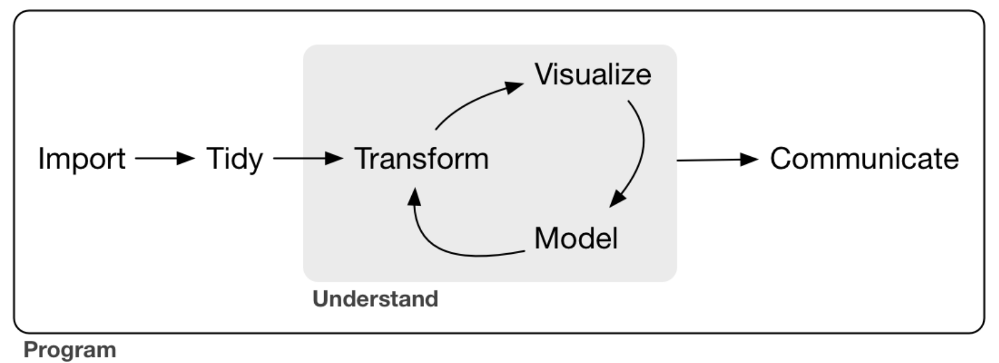

```{r setup, include=FALSE}
knitr::opts_chunk$set(echo = TRUE, warning = FALSE, message = FALSE, 
                      fig.width = 10, fig.height = 6, fig.retina = 2,
                      dev = "ragg_png", res = 1000)
```



## Introduction

La première étape de tout processus d'analyse de données consiste à obtenir les données. Les données peuvent être dans divers formats, mais les plus répandu sont les fichiers texte et Excel. Ce tutoriel a pour but d'expliquer comment importer des données à partir de fichiers courants dans R en utilisant les packages comme `{readr},{readxl},{writexl}` .

Avant toute chose, il est important d'attirer votre attention sur les noms des fichiers et dossiers sur votre ordinateur. il est important d'éviter les espaces, les accents et d'autres caractères spéciaux dans les noms de dossiers ou fichiers. Préferer par exemple "*analyse_sous_R"* à "*Analyse sous R*" comme nom de dossier. Il en est de même pour les fichiers.

## Installation et chargement des packages

Si vous ne disposez pas des **packages** mentionés ci-dessus, installez les en utilisant la commande `install.packages("nom_package")`. Les commandes ci-après servent à installer et charger les packages requis.

```{r packages, message = FALSE}
packages <- c("readr","readxl","vroom","rio")
# install.packages(packages)
library(readr)
library(vroom)
library(readxl)
library(rio)
```

## Import des fichiers textes plats

Les fichiers textes (.csv, .tsv, .txt ) sont un moyen courant de conserver et d'échanger des données rectangulaires, car presque toutes les applications de données prennent en charge l'exportation de données en ces formats. Les formats de fichier texte utilisent des délimiteurs bien définis (virgule, point-virgule, espace, tabulation,etc.). Par conséquent, l'importation de différents types de fichiers texte peut suivre un processus assez cohérent une fois que vous avez identifié le délimiteur.

### Le package {`readr}`

Le *package* `readr` propose plusieurs fonctions adaptées pour importer des fichiers plats de taille limitée (moins de 1 Go) :

-   [`read_csv()`](https://readr.tidyverse.org/reference/read_delim.html) : lecture d'un csv délimité par des virgules, avec un point comme marqueur décimal ;

-   [`read_csv2()`](https://readr.tidyverse.org/reference/read_delim.html) : lecture d'un csv séparé par des points-virgules, avec une virgule comme marqueur décimal ;

-   [`read_delim()`](https://readr.tidyverse.org/reference/read_delim.html) : fonction plus générale et paramétrable, pour lire des fichiers délimités.

Nous allons utiliser `read_csv` et `read_csv2()` et en voici les principales arguments:

-   `file` - chemin du fichier à importer

-   `col_names` - valeurs logique, indique si la première ligne est une en-tête ou non

-   `skip` - le nombre de ligne à sauter avant l'importation (0 par défaut)

Exemple :

```{r read_csv, echo = TRUE,message = FALSE}
data_csv <- read_csv(file = "/Users/ousmane/Documents/data/example_data.csv",
                     col_names = TRUE)
head(data_csv)

```

De même avec `read_csv2` :

```{r read_csv2, echo = TRUE,message = FALSE}
data_csv2 <- read_csv2(file = "/Users/ousmane/Documents/data/example_data2.csv",
                     col_names = TRUE)
head(data_csv2)

```

La fonction [read_delim()](https://readr.tidyverse.org/reference/read_delim.html) est faite pour lire toutes sortes de fichiers plats, et propose de nombreuses options pour l'adapter au fichier considéré. Elle est puissante, mais plus difficile à utiliser que les fonctions [read_csv()](https://readr.tidyverse.org/reference/read_delim.html) et [read_csv2()](https://readr.tidyverse.org/reference/read_delim.html), qui sont des versions simplifiées de [read_delim()](https://readr.tidyverse.org/reference/read_delim.html). En pratique, ces deux fonctions sont le plus souvent suffisantes, et il est rare d'avoir vraiment besoin d'utiliser [read_delim()](https://readr.tidyverse.org/reference/read_delim.html).

La fonction [`read_delim()`](https://readr.tidyverse.org/reference/read_delim.html) propose les mêmes options que [`read_csv()`](https://readr.tidyverse.org/reference/read_delim.html) et [`read_csv2()`](https://readr.tidyverse.org/reference/read_delim.html), avec deux ajouts principaux :`delim` : le délimiteur du fichier plat ;

-   `escape_backslash` (`TRUE`/`FALSE`) : les caractères spéciaux du fichier plat ont-ils un échappement (`\`) ?

Pour en savoir plus sur [`read_delim()`](https://readr.tidyverse.org/reference/read_delim.html), il suffit de consulter l'aide avec [`?read_delim`](https://readr.tidyverse.org/reference/read_delim.html).

Exemple :

Dans cet exemple, nous alons lire et fichier texte dont le délimiteur est tabulation `\t` et les données manquantes codées `NP`

```{r read_delim, echo = TRUE,message = FALSE}
data_delim <- read_delim(
  file = "/Users/ousmane/Documents/data/example_data.tsv",
  col_names = TRUE,
  delim = "\t",
  na = "NP")
head(data_delim)

```

### Le package `{vroom}`

Le package {`vroom}` contient une fonction principale `vroom()` qui est utilisée pour lire tous les types de fichiers textesdélimités. Un fichier délimité est tout fichier dans lequel les données sont séparées (délimitées) par un ou plusieurs caractères. C'est un véritable couteau suisse. Tout ce dont vous avez besoin de savoir c'est qu'il s'agit seulement d'un fichier texte delimité. Il est rapide, et peut même lire des fichiers compréssés.

Exemple avec les trois fichiers précédents :

```{r vroom, echo = TRUE,message = FALSE}
# premier fichier
data_1 <- vroom(file = "/Users/ousmane/Documents/data/example_data.csv")
# le second
data_2 <- vroom(file = "/Users/ousmane/Documents/data/example_data2.csv")
# le troisième
data_3 <- vroom(file = "/Users/ousmane/Documents/data/example_data.tsv",
              na = "NP")
head(data_3)

```

Le tout en une seule fonction !

## Import des fichiers Excel

Les fichiers Excel (.xls et .xlsx) sont largement utilisés pour stocker des données pour des raisons de commodité mais aussi parce que tout le monde sait exploité un fichier Excel.

### Le package `{readxl}`

Le package readxl permet d'extraire facilement des données d'Excel avec R. Par rapport à de nombreux packages existants (par exemple, gdata, xlsx, xlsReadWrite), readxl n'a pas de dépendances externes, il est donc facile à installer et à utiliser sur tous les systèmes d'exploitation. Il est conçu pour fonctionner avec des données tabulaires.

readxl prend en charge à la fois le format .xls hérité et le format .xlsx moderne basé sur XML.

Exemple

```{r readxl, echo = TRUE,message = FALSE}
data_xlsx <- read_excel(
  path = "/Users/ousmane/Documents/data/exemple_data.xlsx")

head(data_xlsx)
```

## Bonus : package `{rio}`

Le package rio permet d'importer une très grande variétés de données avec une seule commande `import()`. La fonction dévine le format à partir de l'extension du fichiers ainsi que les sépareurs de fichiers. Le package est assez pratique. Des liens seront fournies pour en savoir plus sur ce package et bien entendu tpour out les autres aussi.

```{r rio, echo = TRUE,message = FALSE}
library(rio)
install_formats()
data_xlsx <- import(file = "/Users/ousmane/Documents/data/exemple_data.xlsx")
head(data_xlsx)
```

## Pour en savoir plus

<https://www.book.utilitr.org/> - Chapitre 14-16 (en français)

[UC R Data Import tutorial](http://uc-r.github.io/import) - Bradley Bohemke

[Le package rio](https://github.com/leeper/rio) - en savoir plus

[Le package vroom](https://vroom.r-lib.org) - en savoir plus

[Le package readr](https://readr.tidyverse.org/) - en savoir plus

## La session R

Analyses were conducted using the R Statistical language (version 4.0.5; R Core Team, 2021) on macOS Big Sur 11.6.1, using the packages rio (version 0.5.27; Chung-hong Chan et al., 2021), readxl (version 1.3.1; Hadley Wickham and Jennifer Bryan, 2019), readr (version 2.1.0; Hadley Wickham and Jim Hester, 2021) and vroom (version 1.5.6; Jim Hester and Hadley Wickham, 2021).

## References

-   Chung-hong Chan, Geoffrey CH Chan, Thomas J. Leeper, and Jason Becker (2021). rio: A Swiss-army knife for data file I/O. R package version 0.5.27.
-   Hadley Wickham and Jennifer Bryan (2019). readxl: Read Excel Files. R package version 1.3.1. <https://CRAN.R-project.org/package=readxl>
-   Hadley Wickham and Jim Hester (2021). readr: Read Rectangular Text Data. R package version 2.1.0. <https://CRAN.R-project.org/package=readr>
-   Jim Hester and Hadley Wickham (2021). vroom: Read and Write Rectangular Text Data Quickly. R package version 1.5.6. <https://CRAN.R-project.org/package=vroom>
-   R Core Team (2021). R: A language and environment for statistical computing. R Foundation for Statistical Computing, Vienna, Austria. URL <https://www.R-project.org/.>
