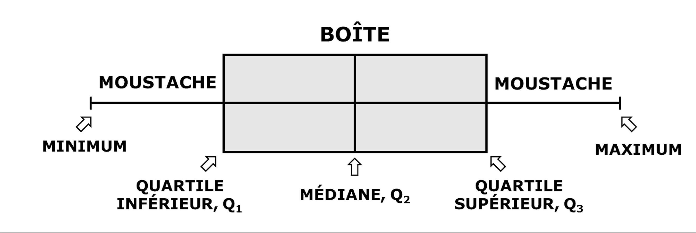

```{r setup, include=FALSE}
knitr::opts_chunk$set(echo = TRUE,fig.width = 10,
                      fig.height = 6, fig.retina = 2,
                      dev = "ragg_png", res = 1000,warning = FALSE)
```

## Introduction

L'analyse exploratoire des données ou AED, est une étape cruciale dans tout projet d'analyse de données ou de science des données. L'AED consiste à dégager les grandes tendances des données, en particulier en réalisant des graphiques, tableaux et tests statistiques qui permettent de mettre en évidence les caractéristiques individuelles des variables et les relations entre elles.

Dans cet article vous apprendrez comment explorer vos données en toute simplicité et rapidité avec R. De nombreuses méthodes et librairies existent mais le but est d'accélérer la partie calcul afin que vous ayez suffisamment du temps pour l'interprétation des résultats.

## Reproductibilité

Dans cette section nous vous présentons tout ce dont vous aurez besoin pour reproduire vous même les codes sur votre ordinateur.

### Packages

Vous aurez besoin des librairies suivantes, installez-les si vous ne les avez pas. Ils sont tous disponible sur le CRAN.

```{r Packages , message=F}
library(tidyverse) # manipulation et visualisation de données
library(dlookr) # exploration des données
library(report) # rapport synthétisé
library(extrafont) #
library(hrbrthemes)
library(rmarkdown)
extrafont::loadfonts()
```

### Jeu de données

Pour illustrer tous les calculs nous allons utiliser le jeu de données `penguins` contenu dans le package [palmerpenguins](https://allisonhorst.github.io/palmerpenguins/index.html "palmerpenguins") disponible sur le CRAN également.


Un coup d'oeil rapide sur les données : 8 variables et 344 observations. ça pouvait être pire 😄.

```{r}
library(palmerpenguins)
penguins %>% 
  rmarkdown::paged_table()
```

## Exploration numérique

Dans cette section, il va s'agir d'explorer les données d'un point de vue numérique, en calculant des statistiques utiles. Beaucoup de méthodes existent pour le faire mais j'opte pour le package `dlookr` mon coup de cœur pour au moins trois raisons :

-   Il est simple, intuitif avec une syntaxe facile à comprendre

-   Il s'intègre aisément au verbe tidyverse, ce qui permet de le connecter à bien de packages comme `report`, `ggplot2`, et pleins d'autres. Cette inter-combinaison croyez moi peu vous faire économiser beaucoup en terme de temps!

-   Il est robuste, puissant et rapide.

Alors sans plus tardé entrain dans le vif du sujet.

### Aperçu des données

Quand on acquiert les données on veut le plus souvent avoir une vue synthétique de celles ci. Cela permet de fixer clairement le nombre de variables, d'observations et le type de chaque variable. le package `report` permet de le faire et offre une vue générale et textuelle du jeu de données. Malheureusement la sortie est en anglais.

```{r}
penguins %>% 
  report() %>% 
  summary()
```

### Inspecter les données

L'inspection servira à décrire les données, à proposer des résumés statistiques et une évaluation des données manquantes (nombre et proportion) pour chaque variable selon son type.

-   Inspection générale de l'ensemble des données :

```{r}
penguins %>% 
  diagnose() %>% 
  rmarkdown::paged_table()
```

-   Inspection par type

```{r}
penguins %>% 
  diagnose_numeric() %>% 
  rmarkdown::paged_table()
```

En exécutant ces lignes de codes vous avez les informations suivantes pour chaque variable variable numérique ! notez bien que les variables `species` et `sex`manquent ici. Vous connaisez la plupart des statistiques calculées.

-   `zero` représente le nombre de valeurs nulles

-   `minus` le nombre de valeurs négatives

-   `outlier` le nombre de valeurs potentiellement aberrantes.

Par contre le code ci dessous va renseigné sur les variables catégorielles :

```{r}
penguins %>% 
  diagnose_category() %>% 
  rmarkdown::paged_table()
```

-   `levels` les catégories possible pour chaque variable

-   `N` = nombre d'observations pour chaque levels

-   `Freq` = la fréquence

-   `ratio` = la fréquence en termes de proportion

-   `rank` = le rang de chaque levels , dans chacune des variables

### Résumés statistiques

Il s'agit de calculer les statistiques clés pour les différentes variables numériques. ici on peut faire d'une pierre deux, enfin trois coups car on a la possibilité de calculer à la fois les paramètres de position, de dispersion et les paramètres de formes.

```{r}
penguins %>% 
  describe() %>% 
  rmarkdown::paged_table()
```

Ce bout de code calcule plein de statistiques intéressantes, en plus de cela nous montre aussi le nombre de données manquantes par variable. Extrayons les différentes statistiques par groupe pour plus de lisibilité :

```{r}
penguins %>% 
  describe() %>% 
  select(variable:kurtosis) %>% 
  rmarkdown::paged_table()
```

skewness (asymétrie) et kurtosis (aplatissement) sont des paramètres de forme calculé pour chaque variable.

Nous pouvons également, décider des quantiles à calculer , par exemple ici les quintiles :

```{r}
penguins %>% 
  describe(quantiles =c(.20,.40,.60,.80)) %>% 
  select(variable,n,na,starts_with("p")) %>% 
  rmarkdown::paged_table()
```

### Lien entre les variables

En AED, on cherche aussi à voir si des variables particulières (par pair) sont corrélées. nous pouvons réaliser cela comme suit:

```{r, layout = "l-body-outset"}
penguins %>% 
  correlate() %>% 
  head(10) %>% 
  rmarkdown::paged_table()
```

Nous avons juste montré les 10 premières valeurs. Par défaut la méthode utilisée est `pearson`. Nous pouvons également spécifier la méthode pour `spearman` ou `kendall`. Ici nous allons calculer les trois :

```{r}

# pearson
pearson <- penguins %>% 
  correlate(method = "pearson") %>% 
  rename(pearson_corr = coef_corr)
# spearman
spearman <- penguins %>% 
  correlate(method = "spearman") %>% 
  rename(spearman_corr = coef_corr)
# kendall 
kendall <- penguins %>% 
  correlate(method = "kendall") %>% 
  rename(kendall_corr = coef_corr)

# combinaison en une seule table

full_join(x = pearson,y = spearman) %>% 
  full_join(x = .,y = kendall) %>% 
  rmarkdown::paged_table()
```

## Exploration graphique

Nous allons à présent voir comment explorer les données de façon visuelle à travers des graphiques avec l'excellent package `ggplot2` . Personnalisation des gaphes :

```{r}
# theme global
theme_set(
  theme_ipsum_rc(base_size = 22,
                 plot_title_size = 30,
                 axis_title_size = 22,
                 caption_size = 22)
  )
```

### Nuage de points

Type de graphique qui utilise des points pour représenter les valeurs de deux variables numériques différentes. La position de chaque point sur l'axe horizontal et vertical indique les valeurs d'un point de données individuel. Le nuage de points est utilisé pour observer les relations entre les variables.

Pour en réaliser avec ggplot2 :

```{r}
ggplot(data = penguins,
       mapping = aes(x =bill_length_mm,y = bill_depth_mm))+
  geom_point(size = 3)+
  labs(title = "Bill length vs Bill depth",
       caption = "Data Science avec R - 2021, tous droits reservés",
       x = "Bill Length (mm)",
       y = "Bill Depth (mm)"
       )
```

Une modification courante du nuage de point de base est l'ajout d'une troisième variable. Les valeurs de cette troisième variable peuvent être codées en modifiant la façon dont les points sont représentées. Pour une troisième variable qui indique des valeurs catégorielles (species par exemple), le codage le plus courant est la couleur des points. En donnant à chaque point une couleur distincte, il est facile de montrer l'appartenance de chaque point à un groupe spécifique.

```{r}
ggplot(
  data = penguins,
       mapping = aes(x =bill_length_mm,
                     y = bill_depth_mm, colour = species) ) +
 geom_point(size = 3)+
  labs(title = "Bill length vs Bill depth",
       caption = "Data Science avec R - 2021, tous droits reservés",
       x = "Bill Length (mm)",
       y = "Bill Depth (mm)"
       )+
  scale_colour_viridis_d()+
  theme(legend.position = "top")
```

Pour chaque groupe de points, il est maintenant aisé de distinguer, apprécier la forme du nuage de points. Il est tout a fait possible d'avoir la même information par species :

```{r}
ggplot(
  data = penguins,
       mapping = aes(x =bill_length_mm,
                     y = bill_depth_mm, colour = species) ) +
 geom_point(size = 3)+
  labs(title = "Bill length vs Bill depth",
       caption = "Data Science avec R - 2021, tous droits reservés",
       x = "Bill Length (mm)",
       y = "Bill Depth (mm)"
       )+
  scale_colour_viridis_d()+
  theme(legend.position = "none",
        strip.text = element_text(size =22,hjust = .5),
        strip.background = element_rect(fill="gray") )+
  facet_wrap(~species)
```

### Histogramme

L'histogramme est un outil fréquemment utilisé pour résumer des données discrètes ou continues qui sont présentées par intervalles de valeurs. Il est souvent employé pour montrer les caractéristiques principales de la distribution des données de façon pratique. Il est utile pour résumer de grands ensembles de données (plus de 100 observations). Il peut également faciliter la détection d'observations inhabituelles (valeurs aberrantes) ou les intervalles sans point de donnée.

Pour en réaliser avec ggplot2

```{r}
ggplot(data = penguins,mapping = aes(x = bill_length_mm)
         ) + 
  geom_histogram(bins = 30,alpha = .5)+
  labs(title = "Bill length by species",
       caption = "Data Science avec R - 2021, tous droits reservés",
       x = "",
       y = "Bill Length (mm)")
```

Tout comme pour le nuage de points, une troisième variable peut être codée et/ou utilisée pour séparer les histogrammes:

```{r}
ggplot(data = penguins, mapping = aes(x = bill_length_mm,
                       fill = species)
         ) + geom_histogram(bins = 30,alpha = .8)+
  labs(title = "Bill length by species",
       caption = "Data Science avec R - 2021, tous droits reservés",
       x = "",
       y = "Bill Length (mm)")+
  scale_fill_viridis_d()
```

ou :

```{r}
ggplot(data = penguins, mapping = aes(x = bill_length_mm,
                       fill = species)
         ) + geom_histogram(bins = 30,alpha = .8)+
  labs(title = "Bill length by species",
       caption = "Data Science avec R - 2021, tous droits reservés",
       x = "",
       y = "Bill Length (mm)")+
  scale_fill_viridis_d()+
  theme(legend.position = "none",
        strip.text = element_text(size =22,hjust = .5),
        strip.background = element_rect(fill="gray") )+
  facet_wrap(~species)
  
```

### Boite à moustaches ou Boxplot

La boîte à moustaches, parfois appelée diagramme en boîte ou diagramme de quartiles, est un type de diagramme qui permet de visualiser synthétiquement les données. Elle ne montre pas la distribution avec autant de détails que l'histogramme, mais elle est particulièrement utile pour indiquer si une distribution est asymétrique et s'il y a des valeurs potentiellement extrêmes dans l'ensemble de données. La boîte à moustaches est également idéale pour comparer des distributions, car elle fait apparaître immédiatement le centre, la dispersion et l'étendue.



pour en réaliser avec ggplot2 :

```{r }
ggplot(data = penguins, aes(x = species, y = bill_length_mm, fill =species))+
  geom_boxplot(outlier.color = "red",outlier.size = 3)+
  labs(title = "Bill length by species",
       caption = "Data Science avec R - 2021, tous droits reservés",
       x = "",
       y = "Bill Length (mm)")+
  scale_fill_viridis_d()+
  theme(legend.position = "none")
```

On peut superposé au boxplot, les points de données pour mieux apprecier visuellement la distribution de ceux-ci.

```{r , preview = TRUE}
ggplot(data = penguins, aes(x = species, y = bill_length_mm, fill =species))+
  geom_boxplot(outlier.color = "red",outlier.size = 3)+
  geom_jitter(size = 3,alpha = 0.5,width = .2)+
  labs(title = "Bill length by species",
       caption = "Data Science avec R - 2021, tous droits reservés",
       x = "",
       y = "Bill Length (mm)")+
  scale_fill_viridis_d()+
  theme(legend.position = "none")
```

### Graphique Quantile-Quantile ou Q-Q plot

Le graphique quantile-quantile (Q-Q plot) est un outil de diagnostic largement utilisé pour évaluer les similitudes et les différences de distribution entre deux échantillons indépendants à une variable. Il s'agit également d'un outil populaire pour vérifier la pertinence d'une distribution de probabilité spécifiée pour des données univariées données.

```{r}
ggplot(data = penguins, aes(sample = bill_length_mm))+
  stat_qq(size = 3 )+stat_qq_line()+
  labs(title = "Bill length by species",
       caption = "Data Science avec R - 2021, tous droits reservés",
       x = "Quantiles théoriques",
       y = "Bill Length (mm)")+
  scale_fill_viridis_d()+
  theme(legend.position = "none")
```

## Visualisation des données manquantes

Dans cette section nous allons voir comment visualiser les données manquantes dans un jeu de données et d'apprécier la distribution (pattern) de celles-ci à l'intérieur de ce même jeu de données. Nous reviendrons dans un autre article sur les techniques d'imputation des données manquantes

La fonction `plot_na_pareto()` permet de réaliser un aperçu synthétique et visuel des données manquantes. Nous reviendrons dans un autre article sur les techniques d'imputation des données manquantes

```{r}
penguins %>% 
  plot_na_pareto(only_na = TRUE,relative = TRUE)
```

## Conclusion

Cet article est une introduction à l'Analyse Exploratoire des Données. Des méthodes avancées et encore plus robustes existent. J'espère que cet article va constituer un bon point de départ pour vous dans vos travaux de recherches et d'analyse. N'hésitez pas à partager vos réactions en commentaires.

## Session info

Analyses were conducted using the R Statistical language (version 4.0.5; R Core Team, 2021) on macOS Big Sur 11.6.1, using the packages hrbrthemes (version 0.8.0; Bob Rudis, 2020), dlookr (version 0.5.2; Choonghyun Ryu, 2021), ggplot2 (version 3.3.5; Wickham. ggplot2: Elegant Graphics for Data Analysis. Springer-Verlag New York, 2016.), stringr (version 1.4.0; Hadley Wickham, 2019), forcats (version 0.5.1; Hadley Wickham, 2021), tidyr (version 1.1.4; Hadley Wickham, 2021), readr (version 2.1.0; Hadley Wickham and Jim Hester, 2021), dplyr (version 1.0.7; Hadley Wickham et al., 2021), kableExtra (version 1.3.4; Hao Zhu, 2021), palmerpenguins (version 0.1.0; Horst AM et al., 2020), tibble (version 3.1.6; Kirill Müller and Hadley Wickham, 2021), purrr (version 0.3.4; Lionel Henry and Hadley Wickham, 2020), report (version 0.4.0; Makowski et al., 2020), naniar (version 0.6.1; Nicholas Tierney et al., 2021), tidyverse (version 1.3.1; Wickham et al., 2019) and extrafont (version 0.17; Winston Chang, 2014).

References

------------------------------------------------------------------------

-   Bob Rudis (2020). hrbrthemes: Additional Themes, Theme Components and Utilities for 'ggplot2'. R package version 0.8.0. <https://CRAN.R-project.org/package=hrbrthemes>

-   Choonghyun Ryu (2021). dlookr: Tools for Data Diagnosis, Exploration, Transformation. R package version 0.5.2. <https://CRAN.R-project.org/package=dlookr>

-   H. Wickham. ggplot2: Elegant Graphics for Data Analysis. Springer-Verlag New York, 2016.

-   Hadley Wickham (2019). stringr: Simple, Consistent Wrappers for Common String Operations. R package version 1.4.0. <https://CRAN.R-project.org/package=stringr>

-   Hadley Wickham (2021). forcats: Tools for Working with Categorical Variables (Factors). R package version 0.5.1. <https://CRAN.R-project.org/package=forcats>

-   Hadley Wickham (2021). tidyr: Tidy Messy Data. R package version 1.1.4. <https://CRAN.R-project.org/package=tidyr>

-   Hadley Wickham and Jim Hester (2021). readr: Read Rectangular Text Data. R package version 2.1.0. <https://CRAN.R-project.org/package=readr>

-   Hadley Wickham, Romain François, Lionel Henry and Kirill Müller (2021). dplyr: A Grammar of Data Manipulation. R package version 1.0.7. <https://CRAN.R-project.org/package=dplyr>

-   Hao Zhu (2021). kableExtra: Construct Complex Table with 'kable' and Pipe Syntax. R package version 1.3.4. <https://CRAN.R-project.org/package=kableExtra>

-   Horst AM, Hill AP, Gorman KB (2020). palmerpenguins: Palmer Archipelago (Antarctica) penguin data. R package version 0.1.0. <https://allisonhorst.github.io/palmerpenguins/>

-   Kirill Müller and Hadley Wickham (2021). tibble: Simple Data Frames. R package version 3.1.6. <https://CRAN.R-project.org/package=tibble>

-   Lionel Henry and Hadley Wickham (2020). purrr: Functional Programming Tools. R package version 0.3.4. <https://CRAN.R-project.org/package=purrr>

-   Makowski, D., Ben-Shachar, M.S., Patil, I. & Lüdecke, D. (2020). Automated Results Reporting as a Practical Tool to Improve Reproducibility and Methodological Best Practices Adoption. CRAN. Available from <https://github.com/easystats/report.> doi: .

-   Nicholas Tierney, Di Cook, Miles McBain and Colin Fay (2021). naniar: Data Structures, Summaries, and Visualisations for Missing Data. R package version 0.6.1. <https://CRAN.R-project.org/package=naniar>

-   R Core Team (2021). R: A language and environment for statistical computing. R Foundation for Statistical Computing, Vienna, Austria. URL <https://www.R-project.org/.>

-   Wickham et al., (2019). Welcome to the tidyverse. Journal of Open Source Software, 4(43), 1686, <https://doi.org/10.21105/joss.01686>

-   Winston Chang, (2014). extrafont: Tools for using fonts. R package version 0.17. <https://CRAN.R-project.org/package=extrafont>
